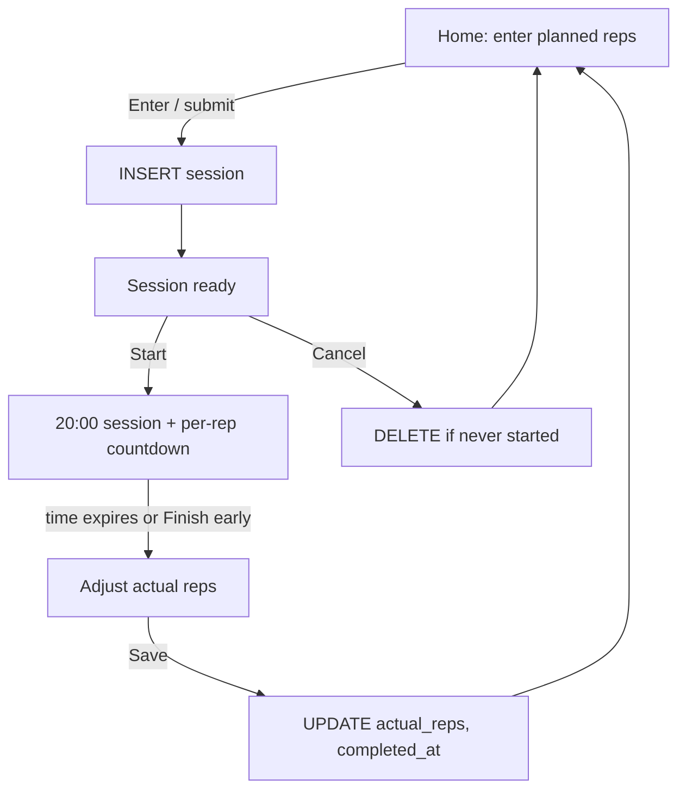

# 20 Minutes — architecture

A client-only PWA for running a single 20-minute rep session. There is no
server, no account, and no network dependency after the app is installed.
Postgres runs in the browser via PGlite and is persisted to IndexedDB.

## Purpose

You tell the app how many reps you plan to do. It carves a 20-minute session
into that many equal windows, counts down both the session and the current
rep, then asks how many reps you actually performed (which may differ) and
saves the result on this device.

## User flow



1. **Home** — one numeric input. Submitting creates a `sessions` row and
   navigates to `/session/:id`.
2. **Ready** — shows planned reps and the computed per-rep length. **Start**
   stamps `started_at`.
3. **Running** — two clocks:
   - session remaining, always 20:00 → 00:00 from `started_at`
   - current-rep remaining, a slice `20:00 / planned_reps`
4. **Log** — input pre-filled with planned reps; the user may raise or lower
   it, then save. The app returns home.

Open (unfinished) sessions stay on the home screen so a refresh or an
installed PWA can resume. Completed sessions appear as a short history.

## Stack

| Layer         | Choice                                              | Why                                                     |
| ------------- | --------------------------------------------------- | ------------------------------------------------------- |
| UI            | SvelteKit 2 + Svelte 5 runes, Tailwind 4            | Already the scaffold; static output                     |
| Hosting shape | `@sveltejs/adapter-static` with `404.html` fallback | GitHub Pages (Actions); installable PWA, no Node server |
| Rendering     | `ssr = false`, `prerender = true` at the root       | PGlite is browser-only; `/` is an app shell             |
| Database      | `@electric-sql/pglite` `idb://twenty-minutes`       | Real Postgres in WASM, durable via IndexedDB            |
| Offline       | SvelteKit `src/service-worker.ts`                   | Precaches the shell, client bundle, and static assets   |
| Install       | `static/manifest.webmanifest` + PNG icons           | Standalone display, theme color, maskable icon          |

## Runtime

Everything after first load happens on the device:

```
┌─────────────────────────────────────────────┐
│  Browser / installed PWA                    │
│                                             │
│  Svelte routes                              │
│    /                    create + history    │
│    /session/:id         ready/run/log       │
│                                             │
│  PGlite (WASM Postgres)                     │
│       │                                     │
│       ▼                                     │
│  IndexedDB  ("twenty-minutes")              │
└─────────────────────────────────────────────┘
```

The layout waits until PGlite has opened and applied the schema before
rendering children. The WASM client is dynamically imported so the
prerendered shell does not try to boot Postgres.

## Routing

| Route           | Prerender         | Role                                                  |
| --------------- | ----------------- | ----------------------------------------------------- |
| `/`             | yes               | Planned-reps input, open sessions, recent history     |
| `/session/[id]` | no (SPA fallback) | Session lifecycle for one row                         |
| `404.html`      | adapter fallback  | Client-side navigation to unknown `/session/:id` URLs |

`trailingSlash` is `never`. Dynamic session URLs are not prerendered; the
static adapter emits `404.html` so GitHub Pages (which serves that file for
unknown paths) and the service worker can still load the client router.

Production is hosted at `https://monsendag.github.io/20-minutes/`. The
GitHub Actions workflow sets `BASE_PATH=/20-minutes` so SvelteKit prefixes
assets and `resolve()` links. Local `vite dev` leaves the base empty.

## Data model

Single table, created on first open:

```sql
CREATE TABLE sessions (
  id            TEXT PRIMARY KEY,          -- crypto.randomUUID()
  planned_reps  INTEGER NOT NULL,          -- 1..1200
  actual_reps   INTEGER,                   -- 0..1200, set on complete
  started_at    TIMESTAMPTZ,               -- set once, on Start
  completed_at  TIMESTAMPTZ,               -- set once, on Save
  created_at    TIMESTAMPTZ NOT NULL DEFAULT now()
);
```

Lifecycle of a row:

| `started_at` | `completed_at`       | UI                         |
| ------------ | -------------------- | -------------------------- |
| null         | null                 | Ready (Start / Cancel)     |
| set          | null, time remaining | Running                    |
| set          | null, time elapsed   | Log actual reps            |
| set          | set                  | Saved; listed under Recent |

`started_at` is written with `COALESCE(started_at, now())` so a double-tap
on Start cannot reset the clock. Cancel deletes the row only if it was
never started.

## Timer model

The clocks are a pure function of persisted `started_at`, planned reps, and
`Date.now()` (`src/lib/timer.ts`). They are not incrementing counters, so
a backgrounded tab, a phone lock, or a refresh catches up instead of
drifting.

```
sessionDuration = 20 * 60 * 1000
repDuration     = sessionDuration / plannedReps
elapsed         = now - startedAt
remaining       = max(0, sessionDuration - elapsed)
currentRep      = min(plannedReps, floor(elapsed / repDuration) + 1)
repRemaining    = currentRep window end - now
```

Display uses `ceil` to whole seconds so `00:00` only appears when the
window is actually finished.

While running, the page:

- ticks every 100ms
- holds a Screen Wake Lock (and re-requests it when the tab is visible
  again)
- vibrates on rep boundaries and at session end, when the API exists

There is no pause. “Finish early” jumps to the log screen without writing
`completed_at` until the user saves, and can return to the timer if time
remains.

## Persistence

`getDb()` is a singleton (`src/lib/db/client.ts`):

```ts
PGlite.create('idb://twenty-minutes', { relaxedDurability: true });
```

`relaxedDurability` avoids blocking each query on an IndexedDB flush, which
is the recommended mode for the IDB filesystem. Schema is applied with
`CREATE TABLE IF NOT EXISTS` / `CREATE INDEX IF NOT EXISTS` on boot.

PGlite is excluded from Vite’s dependency optimizer and marked SSR-external
so WASM/fs bundles are not rewritten.

In `vite dev`, the client is also assigned to `globalThis.__twentyMinutesDb`
so a session can be inspected or forced to completion from the console:

```js
await __twentyMinutesDb.query(
	`UPDATE sessions SET started_at = now() - interval '21 minutes' WHERE id = $1`,
	[id]
);
```

## PWA

- **Manifest** — `static/manifest.webmanifest`, linked from the root layout.
  Standalone display, `#0c0c0d` theme and background, 192/512 any-purpose
  icons plus a 512 maskable icon (safe-zone padding).
- **Apple** — `apple-touch-icon`, `apple-mobile-web-app-capable`, translucent
  status bar.
- **Service worker** — SvelteKit’s `src/service-worker.ts`, auto-registered.
  Precaches Vite `build` assets (including PGlite WASM if emitted), `static`
  files, and prerendered paths. Navigations that miss the cache fall back
  to the prerendered `/` shell so `/session/:id` still boots offline.
- **First visit** — needs the network once to download JS + WASM. After the
  SW activates, sessions continue to work offline because data never left
  the device.

## File map

```
src/
  app.html                         PWA meta, noscript
  service-worker.ts                precache + navigation fallback
  lib/
    constants.ts                   20-minute duration, max reps
    timer.ts                       pure countdown math
    format.ts                      mm:ss and timestamps
    wake-lock.ts                   Screen Wake Lock helper
    db/client.ts                   PGlite singleton + schema
    db/sessions.ts                 CRUD
    components/RepField.svelte     large numeric input
    components/Ring.svelte         SVG progress ring
  routes/
    +layout.ts                     ssr=false, prerender=true
    +layout.svelte                 boot PGlite, app chrome
    +page.svelte                   home
    session/[id]/+page.ts          prerender=false
    session/[id]/+page.svelte      ready / running / log
static/
  .nojekyll                        keep _app/ out of Jekyll
  manifest.webmanifest
  icons/                           192, 512, maskable, apple-touch
.github/workflows/deploy.yml       GitHub Pages (Actions)
docs/architecture.md               this file
```

## Key decisions

1. **Client-only Postgres instead of `localStorage` / IndexedDB documents.**
   The requirement is a PGlite instance backed by IndexedDB. A single
   `sessions` table keeps the lifecycle queryable (open vs completed) without
   an ORM.
2. **Wall-clock start time, not a ticking store.** Persisting `started_at`
   makes resume-after-refresh correct and keeps the two countdowns in lockstep.
3. **Equal time slices, not a rep counter the user taps.** Each rep _is_ a
   duration (`20 minutes / planned reps`). Actual performance is logged
   afterwards, because it can be more or less than planned.
4. **SPA fallback for `/session/:id`.** Static hosting cannot prerender
   arbitrary UUIDs. GitHub Pages has no `200.html` rewrite, so the fallback
   is `404.html`, which Pages already serves for unknown paths.
5. **SvelteKit’s own service worker rather than `vite-plugin-pwa`.** The
   scaffold already uses the unified Vite SvelteKit config; the built-in SW
   module (`$service-worker`) is enough for a single-page offline app.
6. **No backend and no sync.** Sessions are per-origin, per-browser profile.
   Clearing site data deletes the PGlite IndexedDB database.

## Local development

```sh
npm install
npm run dev
```

Production build (static files in `build/`):

```sh
npm run build
npm run preview
```

Installability and the service worker should be checked against `preview`
or a real static host — Vite dev does not exercise the production SW.

A GitHub Pages production build (as CI does):

```sh
BASE_PATH=/20-minutes npm run build
```

Pushes to `main` run `.github/workflows/deploy.yml`, which builds with that
base path and deploys the `build/` artifact via `actions/deploy-pages`.

To jump a running session to the log screen without waiting 20 minutes,
update `started_at` as shown under Persistence and reload `/session/:id`.
